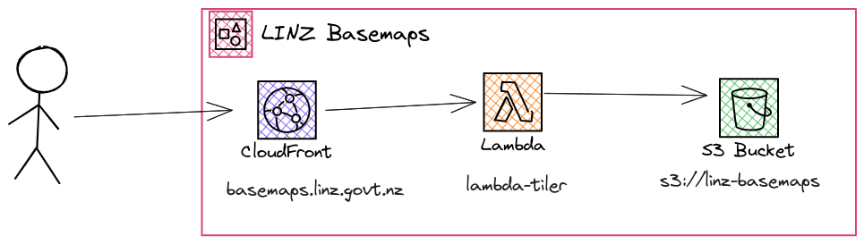
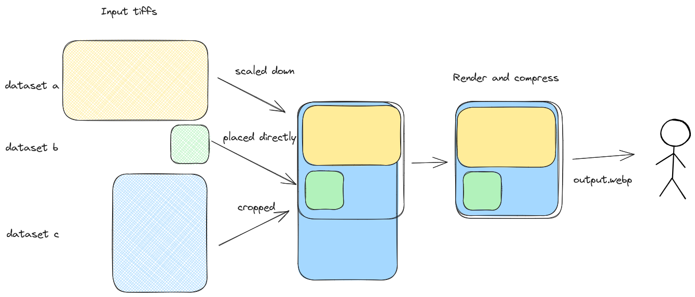

# LINZ Basemaps

[LINZ Basemaps](basemaps.linz.govt.nz) is a collection of tools to create and serve vector and raster basemaps using open source and open standards. It is deigned to be light weight, cost efficent and fast.

Basemaps currently supports both [Imagery](#aerial--satellite-imagery) and [Vector data](#vector-data)

## Background

Land Information New Zealand has a large archive of aerial and satellite imagery freely aviable from [LINZ Data Service](https://data.linz.govt.nz) and [linz/imagery](https://github.com/linz/imagery) this imagery was a primary driver for the creation of the linz basemaps product and service. For more information on how LINZ acquires, ingests and publishes Aerial and satellite imagery see [linz/imagery](https://github.com/linz/imagery)

While linz/basemaps is public, its primary reason is to [work in the open](), so that we can share knoweldge and foster collaboration with peers across the world. While LINZ Basemaps serivce and product can be customised and deployed it is primarily focused on LINZ's usecases of sharing LINZ's aerial imagery archive and Topographic Vector Data

## Basemaps Service

 The core of the LINZ Basemaps Service consists of

- AWS S3 - COG Storage location
- AWS Lambda function - Tile Server - [@basemaps/lambda-tiler](../packages/lambda-tiler/README.md)
- AWS Cloudfront - Content distribution and tile cache
- [linz/basemaps-config](https://github.com/linz/basemaps) - Basemaps configuration

### Imagery Tile Requests

A tile request flows a number of basemaps packages:

Given a request `/v1/tiles/aerial/WebMercatorQuad/6/1/40.webp`,
Breaking down this request url `lambda-tiler` needs to serve a `webp` image that for the tile `{z: 6, x: 1, y: 40}` from the `WebMercatorQuad` tile matrix from the tile set named `aerial` in the default configuration.

Which will then utlize the following packages

- [@basemaps/config](../packages/config/README.md) - Load configuration ([`?config`](./configuration.md))
- [@basemaps/lambda-tiler](../packages/lambda-tiler/README.md) Convert tile XYZ into output coordinates bounding box
- [@basemaps/lambda-tiler](../packages/lambda-tiler/README.md) Determine which tiffs intersect the output coordinates
- [@basemaps/tiler](../packages/tiler/README.md) Determine which parts of the tiffs need to be loaded and resampled
- [@basemaps/tiler-sharp](../packages/tiler-sharp/README.md) - Load the bytes from the tiff and render it as a output image.

Imagery is stored as cloud optimised geotiffs by survey then layered together dynamically based on a [configured priority order](./configuration.md).

[@basemaps/tiler](../packages/tiler/README.md) takes the collection of tiffs and determines how resample (resize/crop) and paint them onto the output tile.

[@basemaps/tiler-sharp](../packages/tiler-sharp/README.md) uses [sharp/libvips](https://github.com/lovell/sharp) to take the output of [@basemaps/tiler](../packages/tiler/README.md) then load the raw tiff bytes and render them into output image.

### Vector tile requests

Vector tiles pre-rendered as [mapbox vector tiles](https://docs.mapbox.com/data/tilesets/guides/vector-tiles-introduction/) and served directly from a [cloud optimised tar](https://github.com/linz/cotar) since there is no merging or dynamic configuration the tile server will just request the specified tile directly from the tar ``

### Additional Processing

#### Aerial & Satellite Imagery Processing

To efficently serve Aerial Imagery to huge of consumers, it should be optimised into a format that makes it easy to serve. All of LINZ's imagery is stored as [cloud optimised geotiffs (COG)](https://www.cogeo.org/), to ensure they are served as efficently as possible some additional processing steps are generally pre-applied to the imagery.

- Reprojection: reprojecting the imagery into common consumption formats (EPSG:3857 and EPSG:2193) will greatly reduce the amount of load and complexity of the basemaps service service
- Tile Alignment: By aligning the COGs to the output XYZ tile grid
- Additional overviews: It is hard to fetch data from 1,000s of tiffs to create a single tile, so we create additional overviews up to z0.

These additional processing steps are part of the basemaps [import process](#TODO) and are controlled by [@basemaps/cogify](../packages/cogify/README.md)

The additional steps are optional but do **greatly improve** the tile serving performance of the service.

#### Vector Data

Vector data is processed from the LINZ topographic vector datasets using tippecanoe, this process is still a work in progress and will.

## Development

Deployments are handled by Github Actions see [Deployments](./deployment.md) for more information.

## Research

### Imagery

- [COG Quality](./imagery/cog.quality.md) - Resampling methods and their affect on output quality COG
- [Relief Shade](./imagery/relief.shade.md) - Relief shading for vector tiles using only imagery "overlay"

### API

- [Empty Tiles API](./api/empty-tiles.md) - Tile API specification research HTTP 204 vs HTTP 200 for non existing tiles

### Diagrams

All diagrams across this repository are created with [excalidraw](https://excalidraw.com/) and embed the excalidraw configuration inside them, so can be re-edited on https://excalidraw.com/
