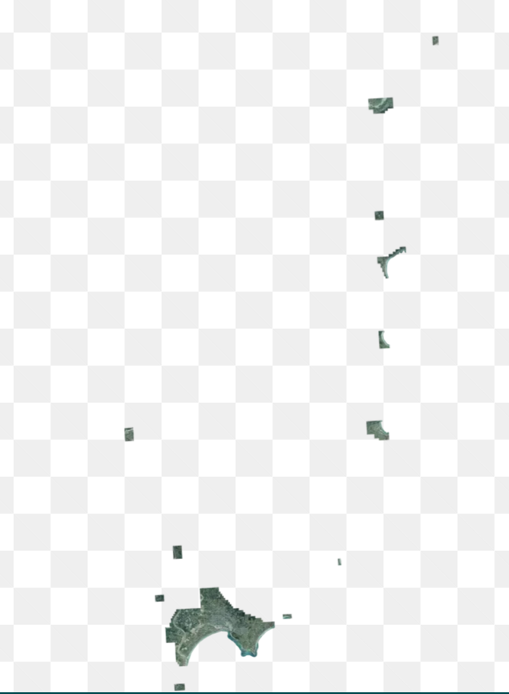

# Sparse Datasets and empty tiles

## TLDR

Basemaps should continue to serve transparent images for areas which do not have any data, for maximum compatibility with clients. Once clients upgrade and fix bugs, either HTTP `204 No Content` or HTTP `200 Ok` with a 0 byte payload responses would be preferable.

Further investigation should also be done on `OATiles-hint: empty` response headers, as well as converting more clients to TileJSON which allows specify a bounding box to restrict where a client requests tiles from.

# Background

LINZ has imagery datasets that are very sparse with large gaps between the sections of valid data, for example Gisborne Urban 2022-2023

Even when providing a bounding box for the imagery, there is still a very large amount of empty space, which results in a large number of empty tiles being served.

# Question

What is the best way to tell clients that the area they are requesting has no data?

# Response Options

The server can use different responses to clients to signal that there is no data, the following section is specifically for imagery responses PNG, Jpeg and WebP.

For Mapbox vector tiles a 0 byte response either `204 No Content` or `200 Ok` both works as a 0 byte vector tile is a valid vector tile.

## 200 Transparent Image

Serve a valid image in the request format for example if a client requests a png serve a fully transparent PNG back to the user

Pros:

- ✔️ Supported Everywhere

Cons:

- ❌ Jpeg does not support transparency so users get a black image
- ❌ Much larger responses 1KB vs 0 byte payload
- ❌ Difficult to know in logs if the tile request was for a valid region

## 200 - 0 Byte

Serve HTTP 200 Ok, With a `content-length: 0` which is a 0 byte response.

Pros:

- ✔️ Supported in GIS ArcGIS/QGIS
- ✔️ Supported by ArcGIS Online, Leaflet, OpenLayers
- ✔️ Supported by HTTP RFC "May return 0 byte 200"
- ✔️ Recommended option from OGC Tile API

Cons:

- ❌ Not supported by maplibre/mapbox
- ❌ HTTP RFC suggests that while valid servers "ought to return 204 No content"

## 204 No Content

return HTTP 204 No Content with no body

Pros:

- ✔️ Supported in GIS ArcGIS/QGIS
- ✔️ Supported by LeafLet, OpenLayers
- ✔️ Supported by HTTP RFC "ought to return 204"
- ✔️ Recommended option from OGC Tile API

Cons:

- ❌ Not supported by ArcGIS Online
- ❌ Not supported by maplibre
  - https://github.com/maplibre/maplibre-gl-js/pull/2325
  - https://github.com/maplibre/maplibre-gl-js/pull/1586
- ❌ Not supported by mapbox gl
  - https://github.com/mapbox/mapbox-gl-js/issues/9304

204 No content not always cached by browser

## 404 Tile Not found

Return a error state saying the tile is not found

- ❌ Is a error state
- ❌ Not always Cached, Browsers/CDN often ignore caching 404

# References

- https://github.com/opengeospatial/ogcapi-tiles/issues/63 - `OATiles-hint: empty` `OATiles-hint: full`
- https://github.com/opengeospatial/ogcapi-tiles/issues/21

Simple proxy that converts `204 No Content` into different results.

- https://github.com/blacha/tile-status-code
