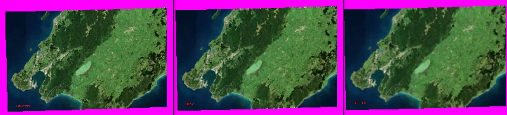
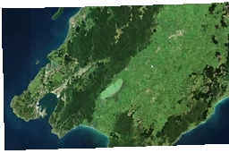
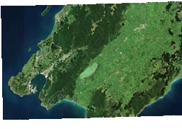
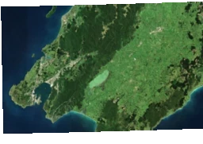
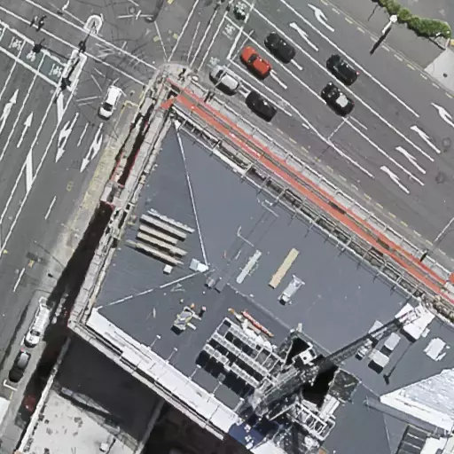

# COG Quality - Resampling with reprojecton and overview creation

creating COGs using a command very similar to

```bash
gdal_translate --version

COMPRESS=webp
BLOCKSIZE=256

for RESAMPLE in cubic lanczos bilinear
do
gdal_translate \
    -of COG \
    -co COMPRESS=$COMPRESS\
    -co NUM_THREADS=ALL_CPUS \
    -co BIGTIFF=YES \
    -co TILING_SCHEME=GoogleMapsCompatible \
    --config BIGTIFF_OVERVIEW YES \
    -co ALIGNED_LEVELS=1 \
    -co SPARSE_OK=TRUE \
    -co ADD_ALPHA=YES \
    -co BLOCKSIZE=$BLOCKSIZE \
    -co RESAMPLING=$RESAMPLE \
    -co QUALITY=90 \
    -co ZOOM_LEVEL_STRATEGY=UPPER \
    $PWD/$TIF_FOLDER/.vrt $PWD/$TIF_FOLDER.$COMPRESS.google.r_$RESAMPLE.bs_$BLOCKSIZE.aligned.cog.tif
done
```


## Overviews

When creating COGs using the different resampling methods the output quality differs a lot.

Here are some overviews created using some of the different resampling methods:



### Lanczos 

Provides quite a nice and crisp output



### Cubic
Creates weird artifacts around the edges



### Bilinear

looks blury




Using lanczos looks best for our overview creation.

## Reprojection resampling

However when we use lanczos for the cog creation we start getting jagged lines inside the high resolution images

Here are some higher resolution aerial imagery image 0 with different resampling methods, these are tiles taken directly from a tiff and converted to webp.

### Lanczos

Creates a jaggeredness, look at the street markings and the edges of the buildings



### Bilinear

Creates a nice image


For our aerial imagery reprojection seems to be best done as bilinear, where as Overview creation seems to be best done as lanczos.


Using GDAL 3.2.x+ this can be configured with

```bash
gdal_translate -co WARP_RESAMPLING=bilinear -co OVERVIEW_RESAMPLING=lanczos
```