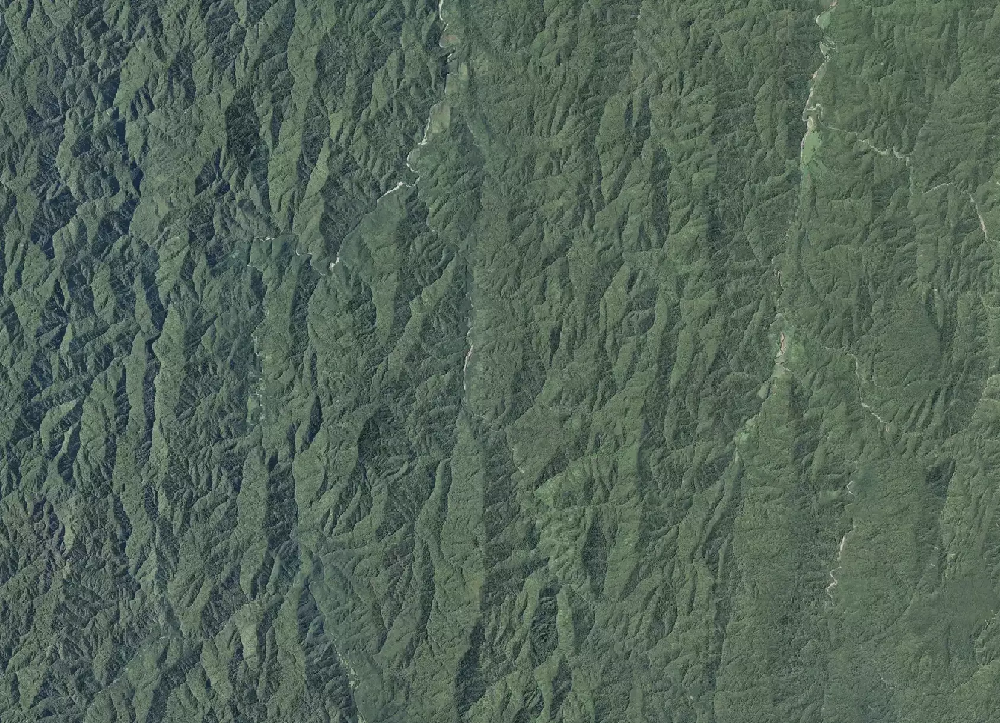
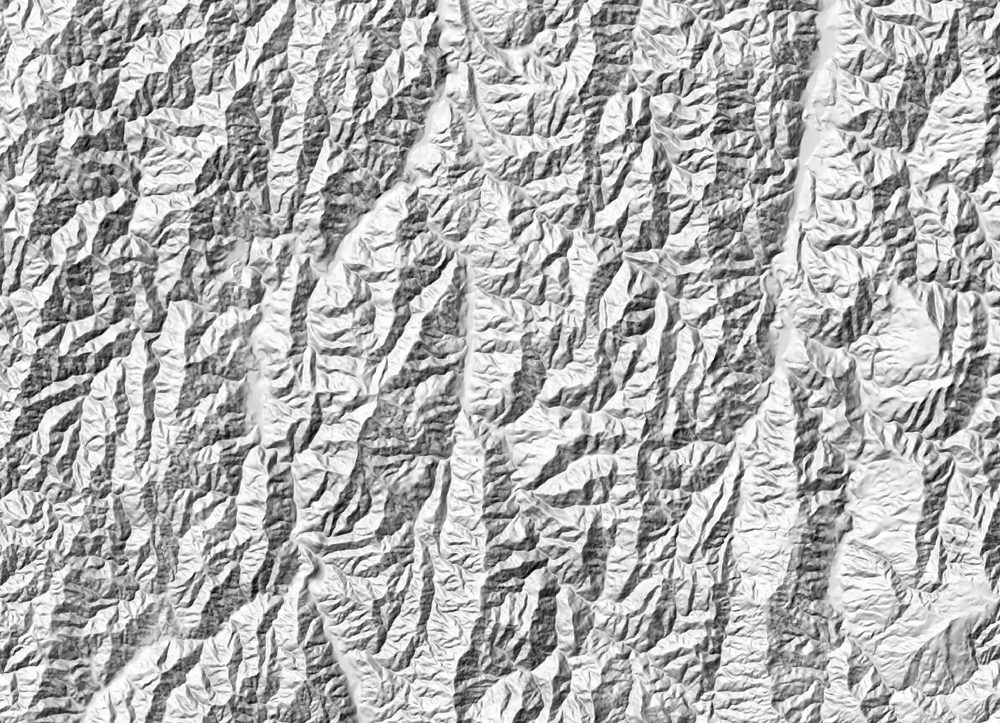
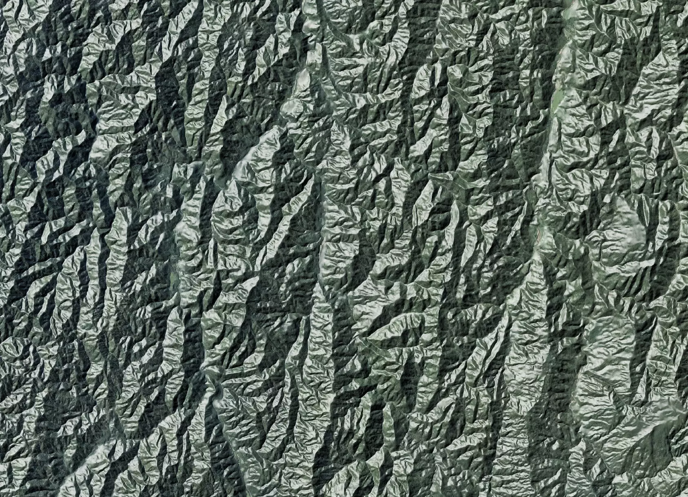
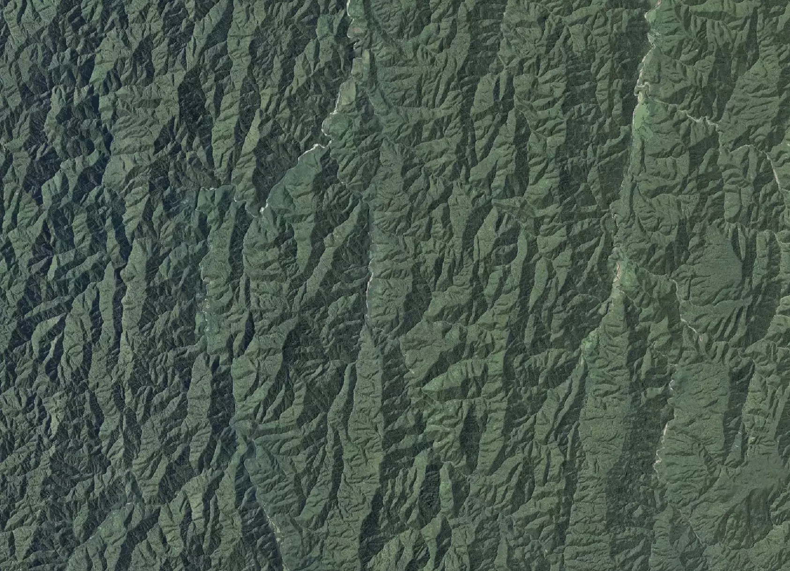

# Relief shade

## Creating a relief shade using GDAL & DEMS

- 8M DEM of NZ - [lds:51768](https://data.linz.govt.nz/layer/51768-nz-8m-digital-elevation-model-2012/)
- GDAL


Create a VRT of all the imagery
```bash
gdalbuildvrt dem/*.tif dem.vrt
```

Create the relief shade

```
gdaldem hillshade -co COMPRESS=lzw -co TILED=yes -co NUM_THREADS=ALL_CPUS -of gtiff \
     -z 1.3 -az 315 -alt 60  -compute_edges \
     dem.vrt dem.hillshade.tiff
```

Apply colors to the relief shade

```
gdaldem color-relief -co COMPRESS=lzw -co TILED=yes -co NUM_THREADS=ALL_CPUS -of gtiff \
    -co ALPHA=YES  -alpha \
    dem.hillshade.tiff color.ramp dem.hillshade.color.tiff
```

## Color ramps & Vector tiles

Relief shading with vector tiles the only imagery operation is "overlay", if any `white` exists in the relief shade it lightens the image

Base Image:


gdaldem hillshade:



Using default color ramp applys whites


Custom color ramp which only applys the darken

```
nv      0       0       0       0
0       0       0       0        255
170      0       0       0       64
220      0       0       0       0
255      0       0       0       0
```

`nv` - No value or NO_DATA  set full alpha

