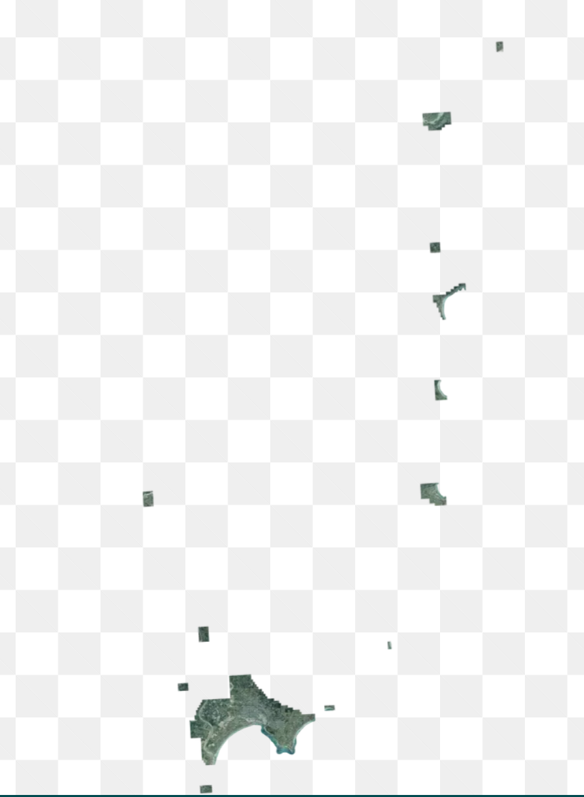

# Sparse Datasets and empty tiles

## TLDR

Basemaps should continue to serve transparent images for areas which do not have any data, for maximum compatibility with clients. Once clients upgrade and fix bugs, either HTTP `204 No Content` or HTTP `200 Ok` with a 0 byte payload responses would be preferable.

Further investigation should also be done on `OATiles-hint: empty` response headers, as well as converting more clients to TileJSON which allows specify a bounding box to restrict where a client requests tiles from.

# Background

LINZ has imagery datasets which are very sparse, with large empty areas between smaller sections of valid data, for example [Gisborne Urban 2022-2023](https://basemaps.linz.govt.nz/?i=gisborne-2022-2023-0.1m).

Even when providing a bounding box for the imagery, there is still a very large amount of empty space, which results in a large number of empty tiles being served.

# Question

What is the best way to tell clients that the area they are requesting has no data?

# Response Options

A server can return different responses to clients to signal that there is no data. The following section is specifically for WebP, JPEG and PNG imagery tiles returned from a tile server.

For Mapbox Vector Tiles, a 0 byte response of either `204 No Content` or `200 Ok` works in clients as a 0 byte vector tile is a valid vector tile.

## 200 Transparent Image

Serve a valid image in the request format (e.g. WebP, JPEG, or PNG). For example if a client requests a PNG, serve a fully transparent PNG tile.

Pros:

- ✔️ Supported everywhere

Cons:

- ❌ JPEG does not support transparency, so users get a black image
- ❌ Much larger responses: 1KB vs 0 byte payload
- ❌ Difficult to know in logs if the tile request was for a valid region

## 200 - 0 Byte

Serve HTTP `200 Ok`, With a `content-length: 0` response header, which is a 0 byte response

Pros:

- ✔️ Supported in ArcGIS Pro and QGIS
- ✔️ Supported by ArcGIS Online, Leaflet, and OpenLayers
- ✔️ Supported by maplibre [since v4.0.0](https://github.com/maplibre/maplibre-gl-js/blob/main/CHANGELOG.md#-bug-fixes-29)
- ✔️ Supported by [HTTP RFC](https://www.rfc-editor.org/rfc/rfc9110.html#name-200-ok), which allows 0 byte `200 Ok` responses as long as the message framing indicates this (via `Content-length=0` response header
- ✔️ Recommended option from OGC Tile API

Cons:

- ❌ Not supported by mapbox gl
- ❌ [HTTP RFC](https://www.rfc-editor.org/rfc/rfc9110.html#name-200-ok) suggests that while valid, servers "ought to return 204 No content"

## 204 No Content

Return HTTP `204 No Content`, with no body

Pros:

- ✔️ Supported in ArcGIS Pro and QGIS
- ✔️ Supported by Leaflet and OpenLayers
- ✔️ Supported by maplibre [since v4.0.0](https://github.com/maplibre/maplibre-gl-js/blob/main/CHANGELOG.md#-bug-fixes-29)
- ✔️ Supported by [HTTP RFC](https://www.rfc-editor.org/rfc/rfc9110.html#name-200-ok): "server ought to return 204 No content"
- ✔️ Recommended option from OGC Tile API

Cons:

- ❌ Not supported by ArcGIS Online
- ❌ Not supported by mapbox gl
  - https://github.com/mapbox/mapbox-gl-js/issues/9304
- Not always cached by browser

## 404 Tile Not found

Return a error state saying the tile is not found

- ❌ Is an error state
- ❌ Not always cached: browsers / CDNs often do not cache 404 responses

# References

- https://github.com/opengeospatial/ogcapi-tiles/issues/63 - `OATiles-hint: empty` `OATiles-hint: full`
- https://github.com/opengeospatial/ogcapi-tiles/issues/21

Simple proxy that converts `204 No Content` into different results.

- https://github.com/blacha/tile-status-code
