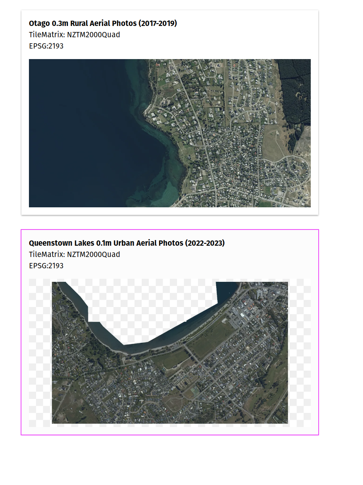

# Running LINZ Basemaps - Quick Start

There are three options for LINZ basemaps server deployment

- Using docker and `@basemaps/server`
- Running `@basemaps/server` directly
- Deploying `@basemaps/server` as a AWS Lambda Function

The easiest option for running linz/basemaps is using docker and [@basemaps/server container](https://github.com/linz/basemaps/pkgs/container/basemaps%2Fserver)

As a base you will need some imagery, [docker](https://docs.docker.com/engine/install/) and the AWS Command line

## Sample Imagery

To use basemaps, we need some [Cloud optimised geotiffs](https://www.cogeo.org/) (COGs), and optionally their [STAC](https://stacspec.org/) metadata

LINZ has a public bucket [`s3://nz-imagery`](https://github.com/linz/imagery) which contains COGs which work well with basemaps.

Wānaka is a nice location so lets grab a combination of rural and urban imagery around Wānaka

- [Queenstown-Lakes 2022-2023 0.1m](https://basemaps.linz.govt.nz/@-44.6966924,169.1330252,z14.74?i=queenstown-lakes-2022-2023-0.1m)
- [Otago Rural 2017-2019 0.3m](https://basemaps.linz.govt.nz/@-44.6966924,169.1330252,z12.74?i=otago-rural-2017-2019-0.3m)

Make a location to put the imagery

```bash
mkdir -p imagery/queenstown-lakes_2022-2023_0.1m/
mkdir -p imagery/otago_2017-2019_0.3m/
```

First download the `collection.json` since this bucket is public, use `--no-sign-request` with the aws cli to ensure your local aws credentials are not used.

```bash
aws --no-sign-request s3 cp s3://nz-imagery/otago/queenstown-lakes_2022-2023_0.1m/rgb/2193/collection.json imagery/queenstown-lakes_2022-2023_0.1m/collection.json
aws --no-sign-request s3 cp s3://nz-imagery/otago/otago_2017-2019_0.3m/rgb/2193/collection.json imagery/otago_2017-2019_0.3m/collection.json
```

Download the Rural imagery 0.3m resolution

```bash
aws --no-sign-request s3 cp s3://nz-imagery/otago/otago_2017-2019_0.3m/rgb/2193/CB12_5000_0107.tiff imagery/otago_2017-2019_0.3m/CB12_5000_0107.tiff
aws --no-sign-request s3 cp s3://nz-imagery/otago/otago_2017-2019_0.3m/rgb/2193/CB12_5000_0108.tiff imagery/otago_2017-2019_0.3m/CB12_5000_0108.tiff
aws --no-sign-request s3 cp s3://nz-imagery/otago/otago_2017-2019_0.3m/rgb/2193/CA12_5000_1007.tiff imagery/otago_2017-2019_0.3m/CA12_5000_1007.tiff
aws --no-sign-request s3 cp s3://nz-imagery/otago/otago_2017-2019_0.3m/rgb/2193/CA12_5000_1008.tiff imagery/otago_2017-2019_0.3m/CA12_5000_1008.tiff
```

Download the Urban imagery 0.1m resolution

```bash
aws --no-sign-request s3 cp s3://nz-imagery/otago/queenstown-lakes_2022-2023_0.1m/rgb/2193/CB12_1000_0434.tiff imagery/queenstown-lakes_2022-2023_0.1m/CB12_1000_0434.tiff
aws --no-sign-request s3 cp s3://nz-imagery/otago/queenstown-lakes_2022-2023_0.1m/rgb/2193/CB12_1000_0435.tiff imagery/queenstown-lakes_2022-2023_0.1m/CB12_1000_0435.tiff
aws --no-sign-request s3 cp s3://nz-imagery/otago/queenstown-lakes_2022-2023_0.1m/rgb/2193/CB12_1000_0435.tiff imagery/queenstown-lakes_2022-2023_0.1m/CB12_1000_0435.tiff
aws --no-sign-request s3 cp s3://nz-imagery/otago/queenstown-lakes_2022-2023_0.1m/rgb/2193/CB12_1000_0436.tiff imagery/queenstown-lakes_2022-2023_0.1m/CB12_1000_0436.tiff
aws --no-sign-request s3 cp s3://nz-imagery/otago/queenstown-lakes_2022-2023_0.1m/rgb/2193/CB12_1000_0437.tiff imagery/queenstown-lakes_2022-2023_0.1m/CB12_1000_0437.tiff
aws --no-sign-request s3 cp s3://nz-imagery/otago/queenstown-lakes_2022-2023_0.1m/rgb/2193/CB12_1000_0438.tiff imagery/queenstown-lakes_2022-2023_0.1m/CB12_1000_0438.tiff

aws --no-sign-request s3 cp s3://nz-imagery/otago/queenstown-lakes_2022-2023_0.1m/rgb/2193/CB12_1000_0534.tiff imagery/queenstown-lakes_2022-2023_0.1m/CB12_1000_0534.tiff
aws --no-sign-request s3 cp s3://nz-imagery/otago/queenstown-lakes_2022-2023_0.1m/rgb/2193/CB12_1000_0535.tiff imagery/queenstown-lakes_2022-2023_0.1m/CB12_1000_0535.tiff
aws --no-sign-request s3 cp s3://nz-imagery/otago/queenstown-lakes_2022-2023_0.1m/rgb/2193/CB12_1000_0536.tiff imagery/queenstown-lakes_2022-2023_0.1m/CB12_1000_0536.tiff
aws --no-sign-request s3 cp s3://nz-imagery/otago/queenstown-lakes_2022-2023_0.1m/rgb/2193/CB12_1000_0536.tiff imagery/queenstown-lakes_2022-2023_0.1m/CB12_1000_0536.tiff
aws --no-sign-request s3 cp s3://nz-imagery/otago/queenstown-lakes_2022-2023_0.1m/rgb/2193/CB12_1000_0537.tiff imagery/queenstown-lakes_2022-2023_0.1m/CB12_1000_0537.tiff
aws --no-sign-request s3 cp s3://nz-imagery/otago/queenstown-lakes_2022-2023_0.1m/rgb/2193/CB12_1000_0538.tiff imagery/queenstown-lakes_2022-2023_0.1m/CB12_1000_0538.tiff
```

## Running Basemaps in Docker

Basemaps server can be run in two modes

1. Directly from the tiff and stac folders
2. With a configuration file

Directly from the tiffs is easier and faster to setup but does not allow for a more custom setup.

### Directly from the tiff files

To start the server, mount the imagery into `/imagery` so the server has access to it

```bash
docker run --rm \
  -v $PWD:$PWD \
  -p 5000:5000 \
  ghcr.io/linz/basemaps/server:latest $PWD/imagery/*
```

!!! note
    Basemaps logs into structured JSON log format it can be useful to run a pretty printer over it such as [pretty-json-log](https://www.npmjs.com/package/pretty-json-log)

    ```bash
    docker run --rm \
      -v $PWD:$PWD \
      -p 5000:5000 \
      ghcr.io/linz/basemaps/server:latest $PWD/imagery/* | pjl
    ```

The server should now be started and you should see the following log lines, informing you that two layers were loaded Otago and Queenstown in [NZTM2000Quad](https://github.com/linz/NZTM2000TileMatrixSet) tile matrix

```
INFO Imagery:Loaded imagery=/home/user/tmp/basemaps-quick-start/imagery/otago_2017-2019_0.3m title=otago_2017-2019_0.3m tileMatrix=NZTM2000Quad files=4
INFO Imagery:Loaded imagery=/home/user/tmp/basemaps-quick-start/imagery/queenstown-lakes_2022-2023_0.1m title=queenstown-lakes_2022-2023_0.1m tileMatrix=NZTM2000Quad files=10
```

Then open a browser to `http://localhost:5000/layers` This will load a list of the layers that have been imported into the system, clicking on any of the layers will take you to the layer.



It is not recommended to run `:latest` for any prolonged period of time, all of the containers are published with the following tags

- `:latest` - Current master branch
- `:vX.Y.Z` - Specific release tag which does not move eg `:v0.0.0`
- `:vX.Y` - Moving tag for the latest major.minor release eg `:v7.0`
- `:vX` - Moving tag for the latest major release eg `:v7`

### Creating a configuration from the tiff files

Using the [basemaps CLI](https://github.com/linz/basemaps/tree/master/packages/cli#usage----bundle) a configuration bundle can be generated.

A [tileset](../configuration.md) needs to be created as the entry point for the configuration.

Below is a configuration for the two example layers, where the rural imagery sets underneath the urban imagery, and the urban imagery is only turned on when the zoom is greater than z15.

storing this JSON into `config/aerial.json`

```json
{
  "type": "raster",
  "id": "ts_basic",
  "title": "Basic Imagery Basemap",
  "layers": [
    {
      // Source location for EPSG:2193 Imagery, has to be absolute
      "2193": "/home/user/basemaps-quick-start/imagery/otago_2017-2019_0.3m/",
      // url/slug friendly name of the imagery set
      "name": "otago_2017-2019_0.3m",
      "title": "Otago 0.3m Rural Aerial Photos (2017-2019)" // from collection.json#title
    },
    {
      "2193": "/home/user/basemaps-quick-start/imagery/queenstown-lakes_2022-2023_0.1m/",
      "name": "queenstown-lakes_2022-2023_0.1m",
      "title": "Queenstown Lakes 0.1m Urban Aerial Photos (2022-2023)",
      // Limit the imagery to greater than z15
      "minZoom": 15
    }
  ]
}
```

Then using the basemaps CLI a config can be bundled, assuming $PWD is the same folder that contains `imagery/` and `config/`

```bash
docker run --rm \
  -v $PWD:$PWD \
  -it ghcr.io/linz/basemaps/cli:latest bundle --config $PWD/config/ --output $PWD/
```

This generates a `config.json` which has all the information needed to start the server

```bash
docker run --rm \
  -v $PWD:$PWD \
  -p 5000:5000 \
  ghcr.io/linz/basemaps/server:latest --config $PWD/config.json
```

For more advanced usage of configuration files please take a look at [linz/basemaps-config](https://github.com/linz/basemaps-config)
