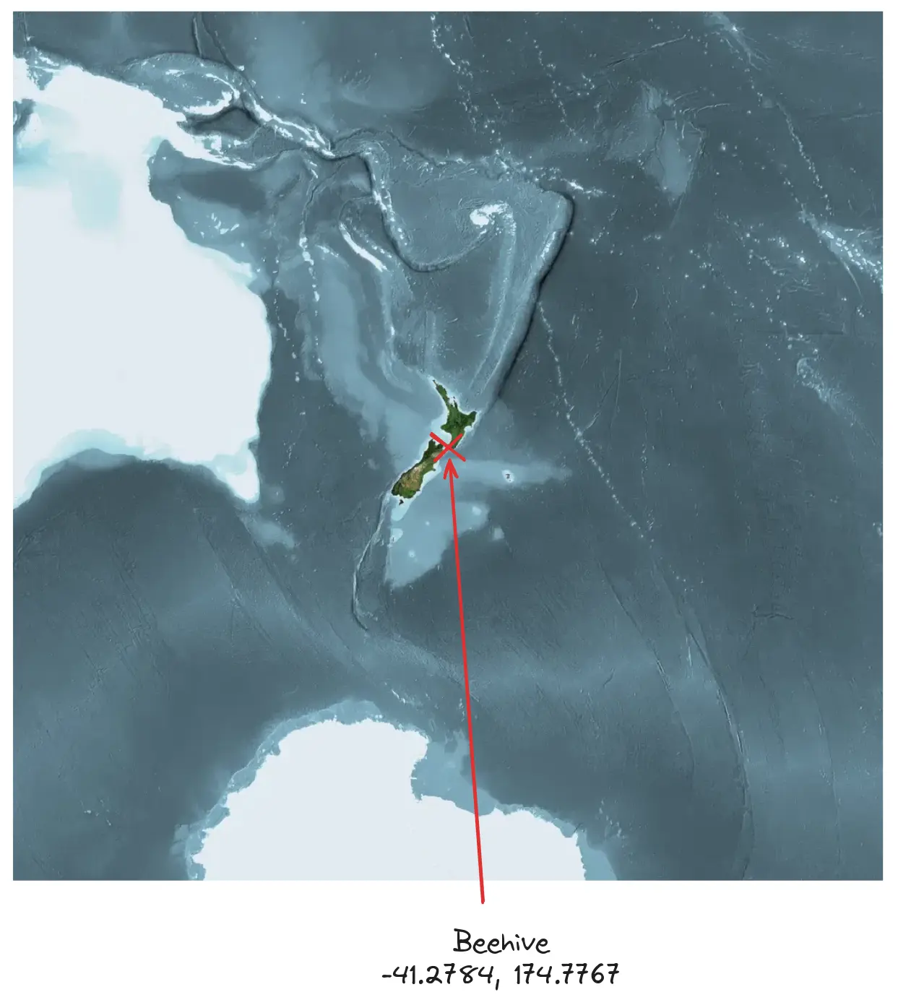
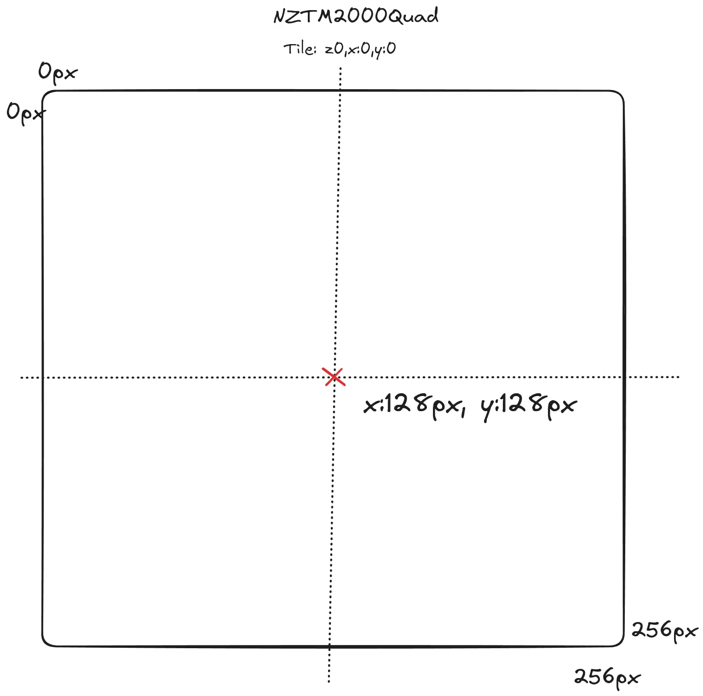
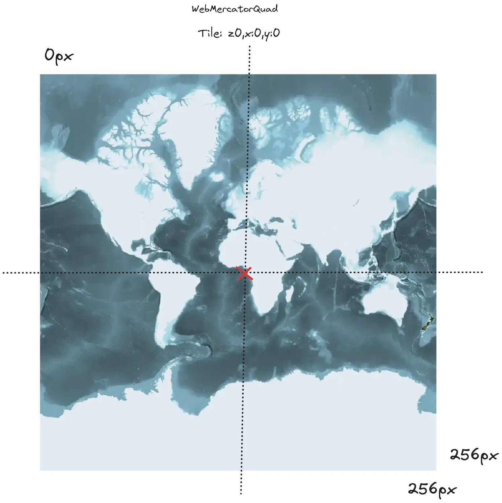

# XYZ and projection math

[NZTM2000Quad](https://github.com/linz/NZTM2000TileMatrixSet) is not supported by many third party tools especially inside the Vector Tile space. Often tools expect tiles to be served as `/{z}/{x}/{y}.mvt` and assume the projection is [WebMercatorQuad]().

Basemaps uses the lack of built in projection information to allow tools to work with NZTM2000Quad tiles without knowing they are in a different tile matrix set.

This is how basemaps provides NZTM2000 support to Aerial imagery on https://basemaps.linz.govt.nz using custom projection logic [basemaps/landing](https://github.com/linz/basemaps/blob/master/packages/landing/src/tile.matrix.ts#L56)

## Background

Tile mapping services use a [TileMatrixSet] to describe where the tiles are meant to be positioned on the globe using a origin point and scale information per zoom level, most web mapping systems assume the tile matrix set is [WebMercatorQuad].

Assuming the target tile matrix set is similar to WebMercatorQuad, which has a square tile grid, with zoom levels increasing at a factor of 2 and starting with a single tile z:0, x:0, y:0 points can be projected into a "fake" version of the tile matrix set and then used with any tool that supports [EPSG:4326] to [EPSG:3857] math such as tippecanoe.

## Process

To create a fake projection from a tile grid the process is

- Take a lat, lon pair (EPSG:4326 degrees) and project into the target projection (eg EPSG:2193)
- Take the target x,y pair (EPSG:2193 metres) and project where in the tile grid the point would be located (px)
- Take the x,y pixels pair and assume it is now a WebMercatorQuad tile then project it to EPSG:3857
- Take the x,y (EPSG:3857 metres) and project it into lat, lon (EPSG:4326)

The point is now in the fake projection and can be combined with applications that consume XYZ tiles

## Example

To convert an example point, such as the [Beehive](<https://en.wikipedia.org/wiki/Beehive_(New_Zealand)>) is located at `-41.2784°`, `174.7767°` (EPSG:4326) 

Converting to NZTM2000 (EPSG:2193) `x: 1748795.82...`, `y: 5428814.899...`

Using NZTM2000Quad to convert to pixel cooridantes of tile z:0, x:0, y:0 yields `x:128.0001..., y:127.999...`



converting to metres EPSG:3857 x: `21.883...`, y: `7.2815...` and then into lat,lon (EPSG:4326) `0.0001...`, `0.0000...` as NZTM2000Quad is centred on the beehive the result of lat,lon approx 0,0 is expected!



These lat,lon coordinates can now be used in a system that works with XYZ tiles but assumes that they are in WebMercatorQuad

### Example Code

Using [@basemaps/geo](https://github.com/linz/basemaps/tree/master/packages/geo)

````typescript
import {NZTM2000QuadTms, GoogleTms, Projection} from '@basemaps/geo'

// Convert to NZTMQuad pixel location
const nztmXy = Projection.get(Nztm2000QuadTms).fromWgs84([174.7767, -41.2784])
const nztmPixels = Nztm2000QuadTms.sourceToPixels(nztmXy[0], nztmXy[1],0)

// Convert from pixels assuming EPSG:3857 WebMercatorQuad
const googleXy = GoogleTms.pixelsToSource(nztmPixels.x, nztmPixels.y, 0)
const latLon = Projection.get(GoogleTms).toWgs84([googleXy.x, googleXy.y])```
````
