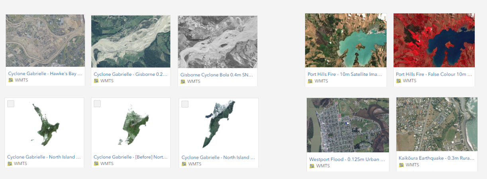

# How to add imagery captured during an emergency to ArcGIS

During an emergency response, LINZ will create an ArcGIS Online item for each imagery dataset published on LINZ Basemaps. The ArcGIS Online item will make it easier to discover and add the imagery to ArcGIS Online.

Either search ArcGIS Online for LINZ imagery emergency or view all available emergency response imagery from the [LINZ Emergency Response Imagery Collection AGOL Group](https://linz.maps.arcgis.com/home/group.html?id=b71aee8952d84164a0ea9c06d5c988fd).

Note the imagery is hosted from LINZ Imagery Basemaps in Web Map Tile Service (WMTS) format.

!!! tip

    If you join the [LINZ Emergency Response Imagery Collection AGOL Group](https://linz.maps.arcgis.com/home/group.html?id=b71aee8952d84164a0ea9c06d5c988fd), it will be easier to find response imagery in future.

