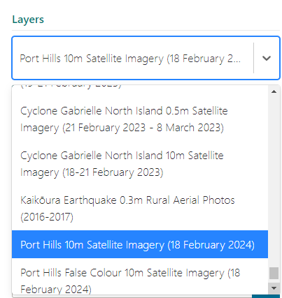

# How to manually add an individual imagery layer (or basemap layers) from LINZ Basemaps to ArcGIS

1. Open [LINZ Basemaps](https://basemaps.linz.govt.nz)

2. Click on the menu icon and select an individual layer or basemap, e.g: Port Hills False Colour 10m Satellite Imagery (18 February 2024).

   

!!! tip

      Search by typing a **date** or **region** to find the layer you need.

      

3. Decide which map projection to work in (NZ Transverse Mercator or Web Mercator)

4. Copy the WMTS url eg https://basemaps.linz.govt.nz/v1/tiles/port-hills-false-colour-2024-10m/NZTM2000Quad/WMTSCapabilities.xml?api=[YourAPIKeyHere]

   

5. Open ArcGIS Online Web Viewer > Add layer > Add layer from URL > Paste WMTS URL from above

6. Remove from the end of the url ##?api=[YourAPIKeyHere]## This should automatically recognise the layer type as WMTS (OGC)

   - Add custom parameter

     - **parameter = api**
     - **value = [YourAPIKeyHere]** eg d01gbxm6mtx9ne1c09y8e6fwd9c (replace this example with your API key)

   - Add custom parameter

     - **parameter = format**
     - **value = png**

   

   

   Note: parameters and values must be lowercase

7. Next > Add to Map

!!! tip

    If you create your own AGOL Item for each imagery layer and then share these with your own AGOL Group, it will make it easier to reuse the imagery again.
