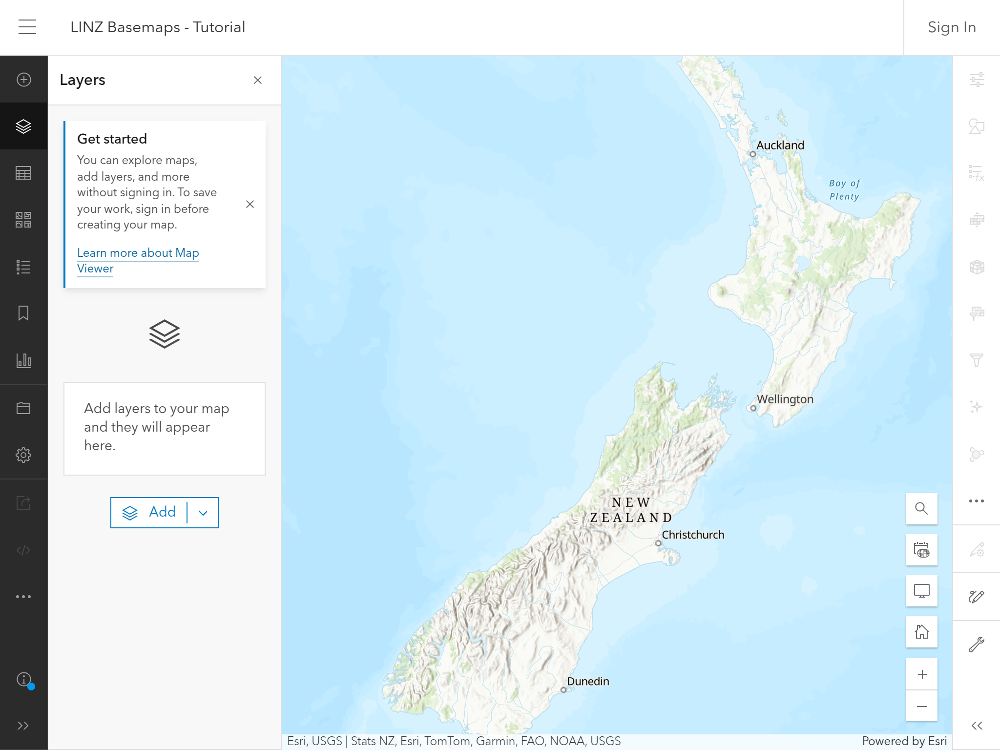
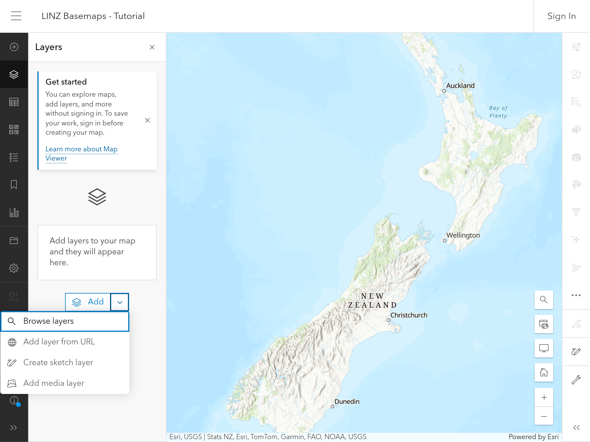
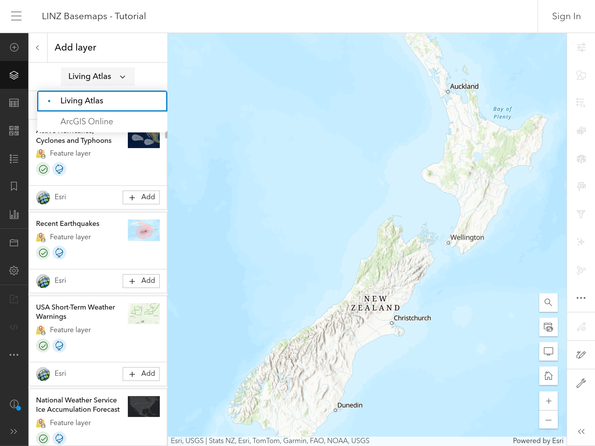
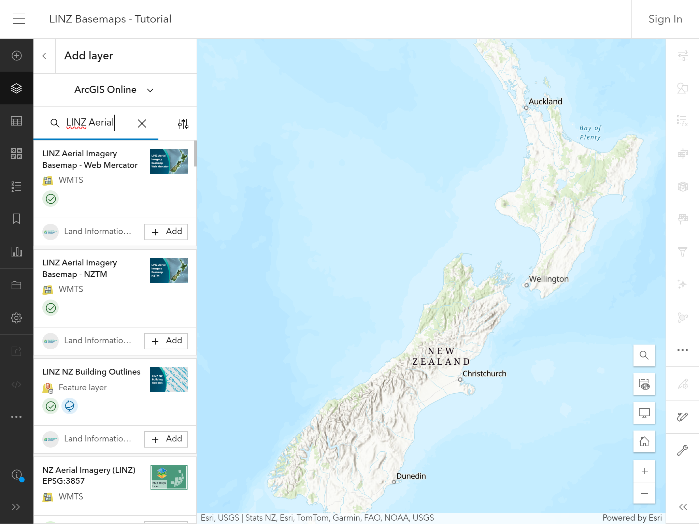
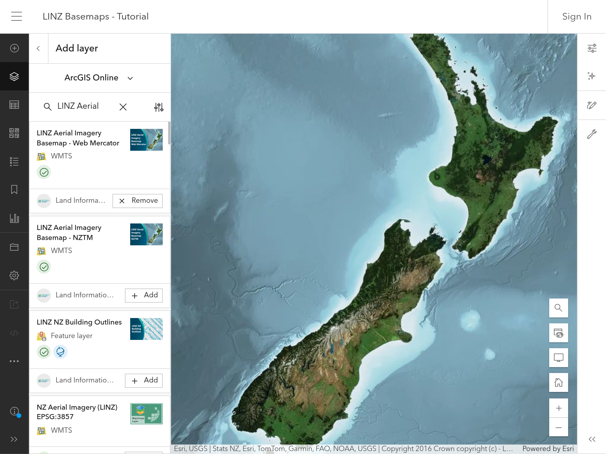

# How to add LINZ Aerial Imagery Basemaps to ArcGIS Online

1. Open the [ArcGIS Online Map Viewer](https://www.arcgis.com/apps/mapviewer/index.html) in a web browser.

   

2. Open the **`Layers`** panel.

   

3. From the dropdown, select the **`Browse layers`** option.

   

4. From the dropdown, select the **`ArcGIS Online`** option.

   

5. Type **`LINZ Aerial Imagery Basemap`** in the search box. You should see two layers in particular:

   1. `LINZ Aerial Imagery Basemap - Web Mercator`
   2. `LINZ Aerial Imagery Basemap - NZTM`

   The two layers are unique by projection. Click the **`+ Add`** button for the desired layer.

   

6. You should now see the desired **`LINZ Aerial Imagery Basemap`** layer on the map.

   
