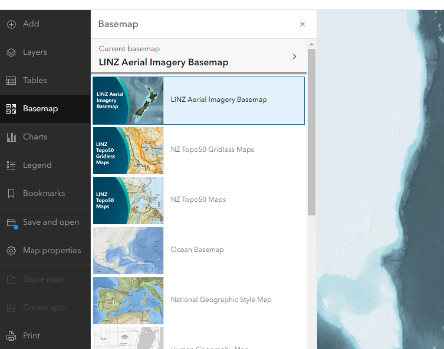

# How to add LINZ Imagery Basemaps to your AGOL basemaps

To change the basemap options for your organisation to offer both Esri, Eagle and LINZ basemaps:

1. Sign in to ArcGIS Online as a role with ArcGIS Administrator privileges

2. Join the [NZ Basemaps Group](https://arcgis.com/home/group.html?id=4033cd7bf65a443cbaf7e1cae0e76f59)

3. In ArcGIS Online, open Organization > Settings > Map

4. Under Basemap Gallery, click the Edit button to open the Group drop-down menu and choose NZ Basemaps Group

   
