# Use in Esri software

This page provides a step-by-step guide to several common ways LINZ Basemaps APIs can be used within Esri software, including ArcGIS Online (AGOL) and Enterprise.

## How to add LINZ Imagery Basemap to ArcGIS Online

=== "Step 1"

    Open the [ArcGIS Online Map Viewer](https://www.arcgis.com/apps/mapviewer/index.html) in a web browser.

    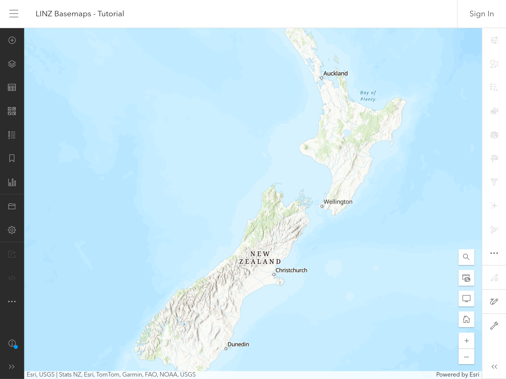

=== "Step 2"

    Open the **`Layers`** panel.

    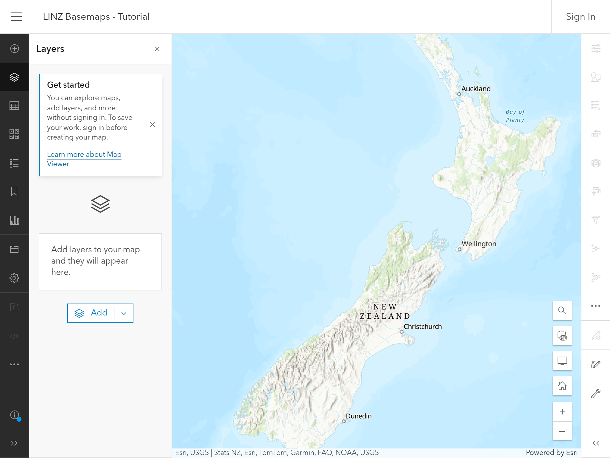

=== "Step 3"

    From the dropdown, select the **`Browse layers`** option.

    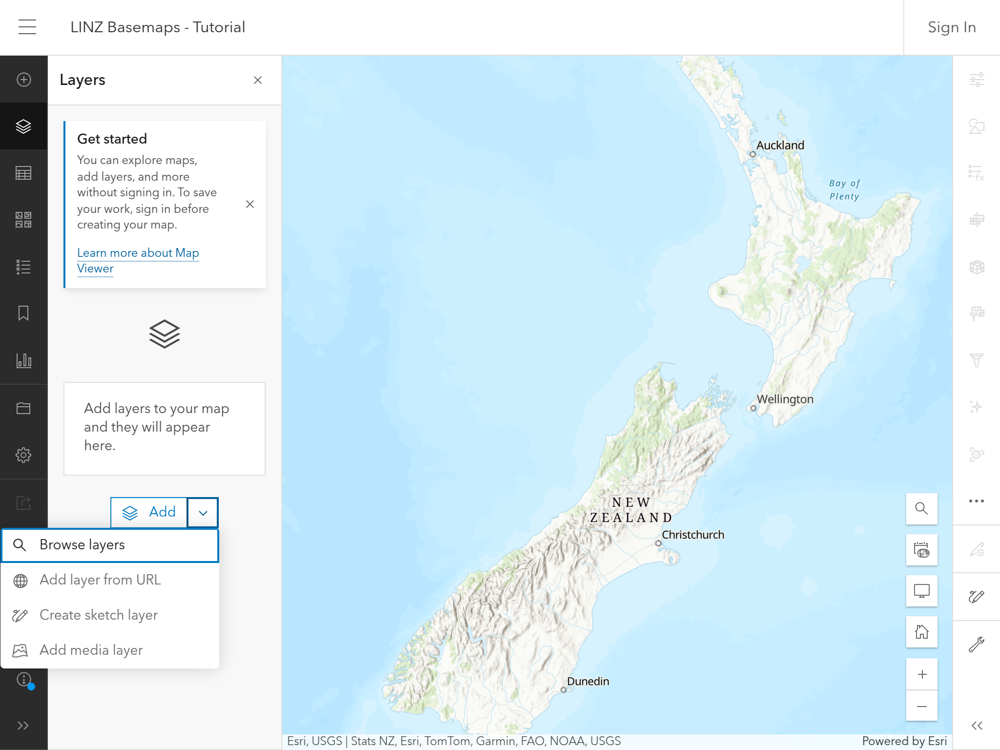

=== "Step 4"

    From the dropdown, select the **`ArcGIS Online`** option.

    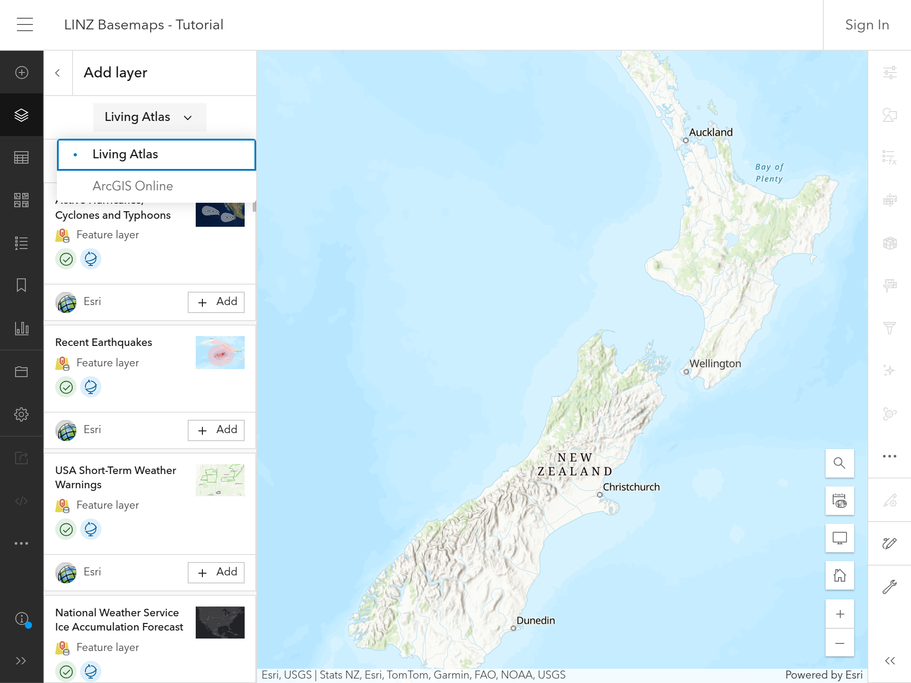

=== "Step 5"

    Type **`LINZ Aerial Imagery Basemap`** in the search box. You should see two layers in particular:

    1.  `LINZ Aerial Imagery Basemap - Web Mercator`
    2.  `LINZ Aerial Imagery Basemap - NZTM`

    The two layers are unique by projection. Click the **`+ Add`** button for the desired layer.

    

=== "Step 6"

    You should now see the desired **`LINZ Aerial Imagery Basemap`** layer on the map.

    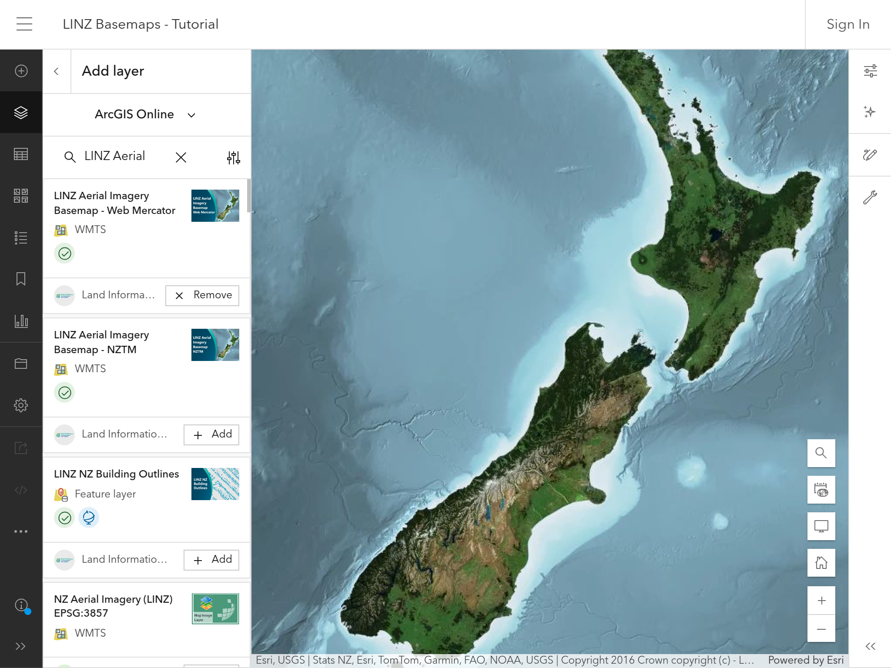

## How to add imagery captured during an emergency to ArcGIS

During an emergency response, LINZ will create an ArcGIS Online item for each imagery dataset published on LINZ Basemaps. The ArcGIS Online item will make it easier to discover and add the imagery to ArcGIS Online.

Either search ArcGIS Online for LINZ imagery emergency or view all available emergency response imagery from the [LINZ Emergency Response Imagery Collection AGOL Group](https://linz.maps.arcgis.com/home/group.html?id=b71aee8952d84164a0ea9c06d5c988fd).

Note the imagery is hosted from LINZ Imagery Basemaps in Web Map Tile Service (WMTS) format.

!!! tip

    If you join the [LINZ Emergency Response Imagery Collection AGOL Group](https://linz.maps.arcgis.com/home/group.html?id=b71aee8952d84164a0ea9c06d5c988fd), it will be easier to find response imagery in future.

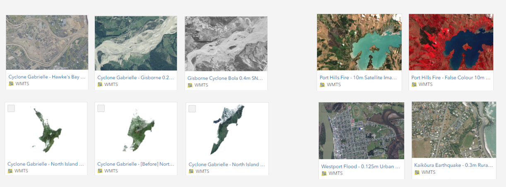

## How to add an individual layer from LINZ Imagery Basemaps to ArcGIS

1. Open LINZ Imagery Basemap LINZ Basemaps

2. Click on the menu icon and select an individual layer, e.g:
   - Port Hills False Colour 10m Satellite Imagery (18 February 2024).

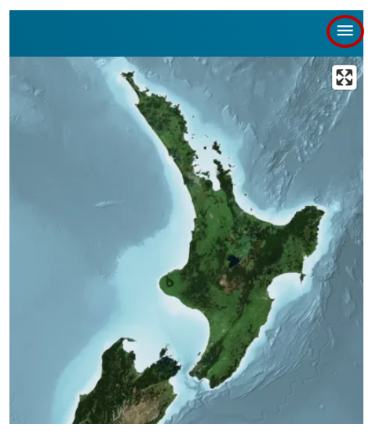

!!! tip

    Search by **date** or **region** to find the layer you need.

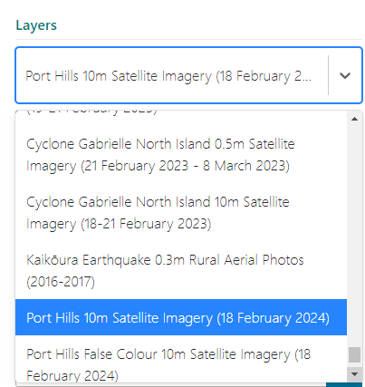

3. Decide which map projection to work in NZ Transverse Mercator or Web Mercator

4. Copy the WMTS url eg https://basemaps.linz.govt.nz/v1/tiles/port-hills-false-colour-2024-10m/NZTM2000Quad/WMTSCapabilities.xml?api=[YourAPIKeyHere]

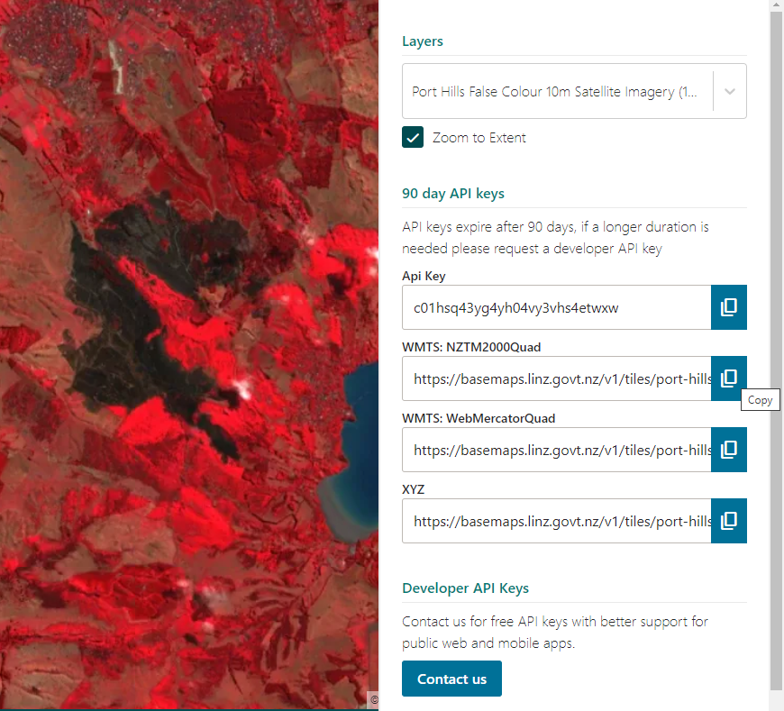

5. Open ArcGIS Online Web Viewer > Add layer > Add layer from URL > Paste WMTS URL from above

6. Remove from the end of the url ##?api=[YourAPIKeyHere]## This should automatically recognise the layer type as WMTS (OGC)

- Add customer parameter

  - **parameter = api**
  - **value = [YourAPIKeyHere]** eg d01gbxm6mtx9ne1c09y8e6fwd9c (replace this example with your API key)

- Add customer parameter
  - **parameter = format**
  - **value = png**

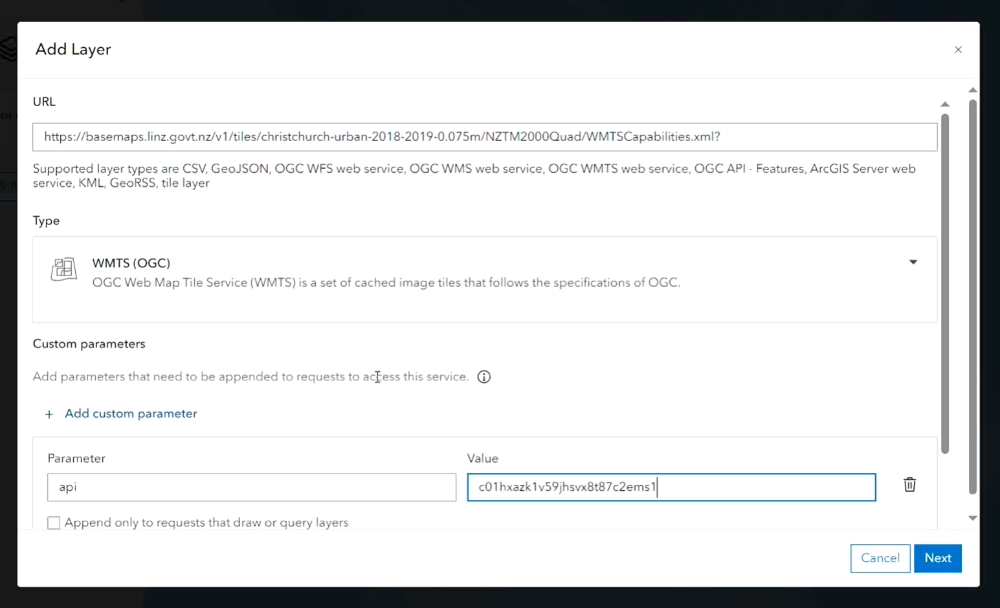

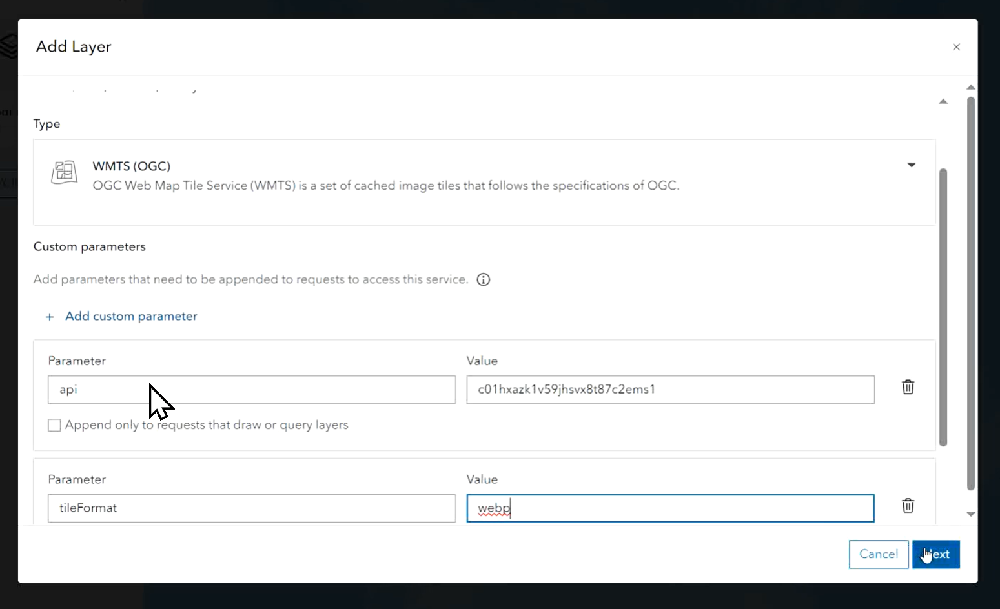

Note parameters and values must be lowercase

7. Next > Add to Map

!!! tip

    If you create your own AGOL Item for each imagery layer and then share these with your own AGOL Group, it will make it easier to reuse the imagery again.

## How to add LINZ Imagery Basemaps to your AGOL basemaps

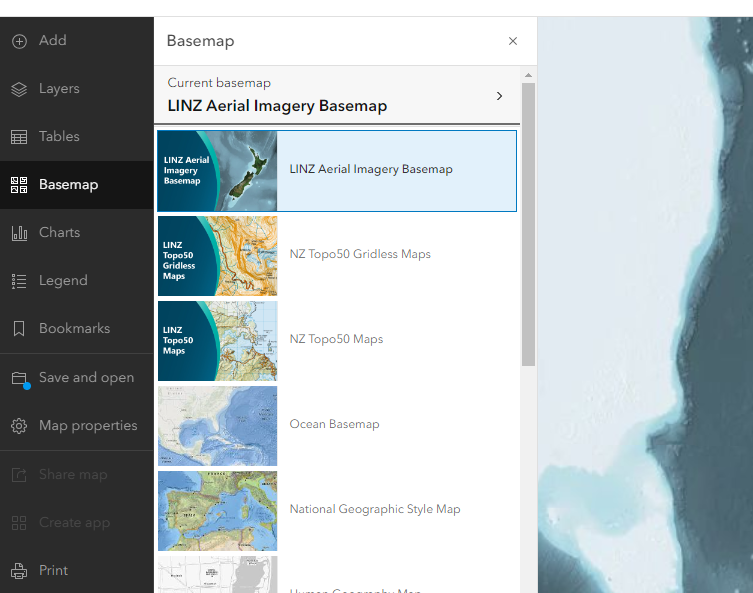

To change the basemap options for your organisation to offer both Esri, Eagle and LINZ basemaps:

1. Sign in to ArcGIS Online as a role with ArcGIS Administrator privileges

2. Join the [NZ Basemaps Group](https://arcgis.com/home/group.html?id=4033cd7bf65a443cbaf7e1cae0e76f59)

3. In ArcGIS Online, open Organization > Settings > Map

4. Under Basemap Gallery, click the Edit button to open the Group drop-down menu and choose NZ Basemaps Group

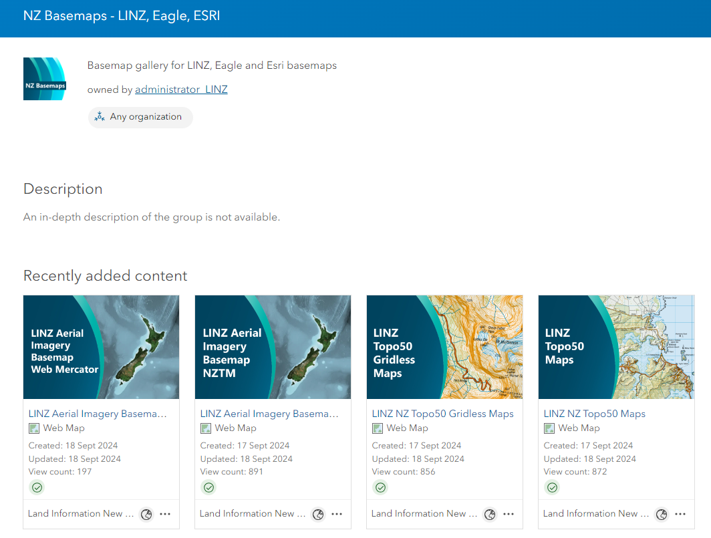
