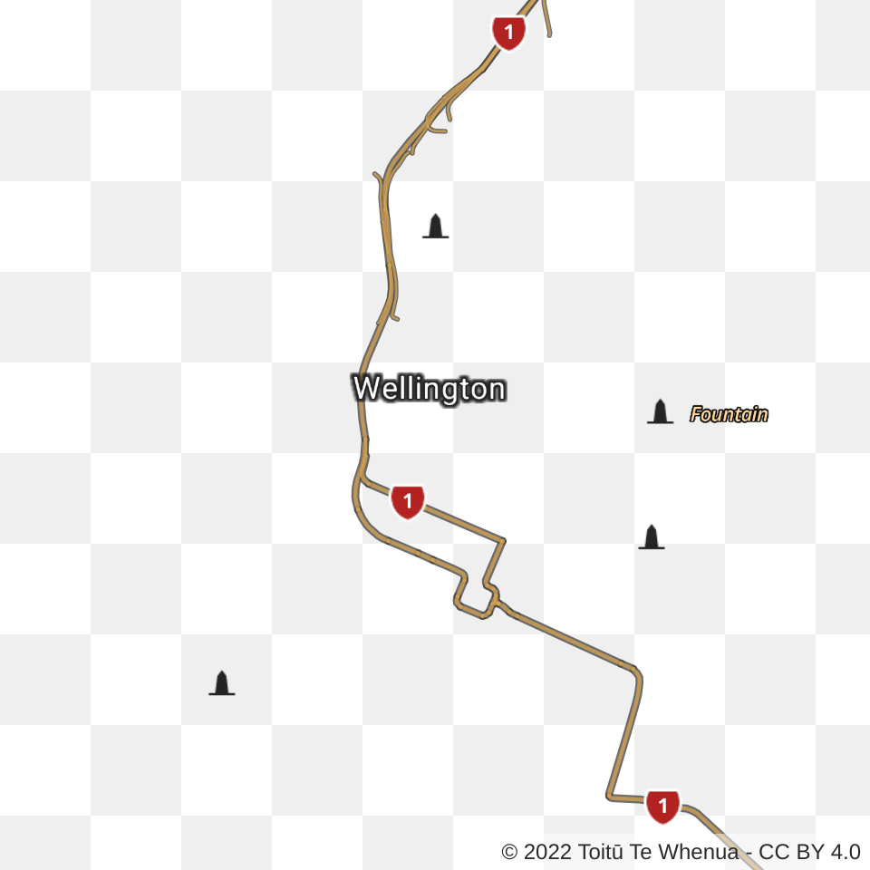

# Working with Vector Tiles

Vector tiles are a modern approach to delivering map data that offers significant advantages over traditional raster tiles. Unlike raster tiles, which are pre-rendered images, vector tiles contain raw geographic data that you can styled dynamically client-side. This means you can customise the colors, labels, and visibility of features without requesting new tiles from the server.

## Why use Vector Tiles?

- **Customization**

  Style your maps on-the-fly - change colors, fonts, and feature visibility.

- **Flexibility**

  Rotate maps and apply custom styles without server requests.

- **Performance**

  Smaller file sizes compared to raster tiles at equivalent quality.

- **Scalability**

  Vector tiles scale infinitely without pixelation, making them perfect for high-resolution displays.

## Which LINZ Basemaps' use Vector Tiles?

We have three vector basemaps. All three use the same tileset, but have different styles that change the way they look:

|        [Labels]        |        [Topolite]        |        [Topographic]        |
| :--------------------: | :----------------------: | :-------------------------: |
|  |  |  |

[Labels]: https://basemaps.linz.govt.nz/?style=labels-v2
[Topolite]: https://basemaps.linz.govt.nz/?style=topolite-v2
[Topographic]: https://basemaps.linz.govt.nz/?style=topographic-v2

We have three guides for working with vector tiles:

- [How to **Use** our Vector Tiles][3]
- [How to **Style** our Vector Tiles][2]
- [How we **Create** our Vector Tiles][1]

[1]: creation/README.md
[2]: styling/README.md
[3]: usage/README.md
