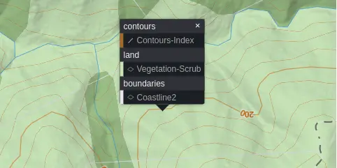
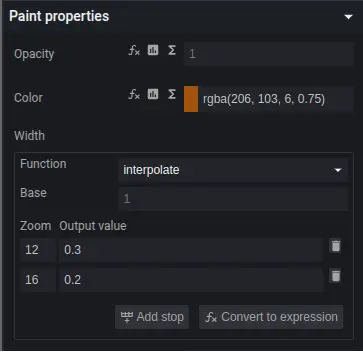
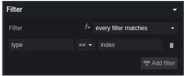

# How to Style our Vector Tiles

LINZ vector tiles can be styled using the [Mapbox GL Style Specification]. This JSON-based specification defines how vector tiles should be rendered, including colors, fonts, and feature visibility. You can view an example of a complete style specification at `https://basemaps.linz.govt.nz/v1/styles/topographic.json?api=YOUR_API_KEY`.
[Mapbox GL Style Specification]: https://docs.mapbox.com/style-spec/guides/

## Understanding the Shortbread Schema

The Shortbread vector tile schema is a lean, general-purpose schema designed for OpenStreetMap data. LINZ has adopted this schema for their vector tiles, making them compatible with a wide ecosystem of tools and styles.

### Key Shortbread Layers Include:

- **water**: Lakes, rivers, and water bodies
- **boundaries**: Boundaries between the land and sea, defined by mean high water
- **transportation**: Roads, paths, railways
- **buildings**: Building footprints
- **place_labels**: City, town, and place names
- **pois**: Points of interest

## LINZ-Specific Considerations

### Land vs Ocean Polygons

One crucial difference when working with LINZ tiles compared to standard Shortbread implementations is that **LINZ defines land polygons rather than ocean polygons**. This means:

- When styling water features, you'll need to style the background as water and the boundaries polygons as your land color
- This is the opposite of many other vector tile providers who define ocean polygons
- Your styles will need to be adjusted accordingly when migrating from other providers

### Using Maputnik (Visual Style Editor)

Maputnik is a free, open-source visual editor for creating and modifying map styles. It's the recommended tool for users of all skill levels.

#### Getting Started with Maputnik

1. **Access Maputnik**

   - Online version: [https://maplibre.org/maputnik](https://maplibre.org/maputnik)
   - Or download for local use [https://github.com/maplibre/maputnik?tab=readme-ov-file#usage](https://github.com/maplibre/maputnik?tab=readme-ov-file#usage)

2. **Connect to LINZ Vector Tiles**
   - Click "Open"
   - Load from URL: `https://basemaps.linz.govt.nz/v1/styles/topographic.json?api=YOUR_API_KEY`
   - Open the Style settings and switch the Style Renderer from MapLibreGL JS to Open Layers (experimental)

#### Example Tutorial: Customizing Contour Lines

Let's walk through changing the color and thickness of contour lines:

1. **Identify the Layer**

   - Click on a contour line on the map
   - Maputnik will show all layers at that location
     

2. **Modify Paint Properties**

   - In the layer panel, find "Paint properties"
   - Change line color: Click the color swatch and select your desired color (e.g., #8B4513 for brown)
   - Adjust line width : Set the thickness (e.g., 1.5 for thicker lines)
     

3. **Add Filters** (optional)

   - Show only major contours (e.g., every 100m):
     

4. **Export Your Style**
   - Click "Export" → "Download Style"
   - Save the JSON file for use in your application

### Customizing in QGIS

QGIS provides a familiar GIS interface for customizing vector tile styles.

#### Accessing Style Properties

1. **Open Layer Properties**

   - Right-click the vector tile layer → Properties
   - Go to Symbology tab
   - You'll see all sub-layers from the vector tiles

2. **Modify Individual Layers**
   - Double-click any sub-layer to edit its style
   - Apply standard QGIS styling options

#### Example: Customizing Water Features

1. **Select the Water Layer**

   - In the Symbology tab, find and select the "water" layer

2. **Change Fill Style**

   - Click on the symbol
   - Set Fill Color: #a5bfdd (light blue)
   - Set Stroke Color: #5080b0 (darker blue)
   - Set Stroke Width: 0.5

3. **Add Rule-Based Styling** (optional)

   - Change from "Single Symbol" to "Rule-based"
   - Add rules for different water types:
     - Rivers: Darker blue
     - Lakes: Standard blue
     - Wetlands: Blue-green

4. **Save Your Style**
   - Click "Style Manager" button → "Save Style"
   - Save as .qml file for reuse in other projects

### Customizing with MapLibre GL JS

For web developers, MapLibre provides programmatic control over styling.

#### Basic Style Customization

```html
--8<-- "user-guide/working-with-vector-tiles/styling/index.maplibre.vector.3857.html"
```

<iframe src="index.maplibre.vector.3857.html" height="500px" width="100%" scrolling="no"></iframe>
