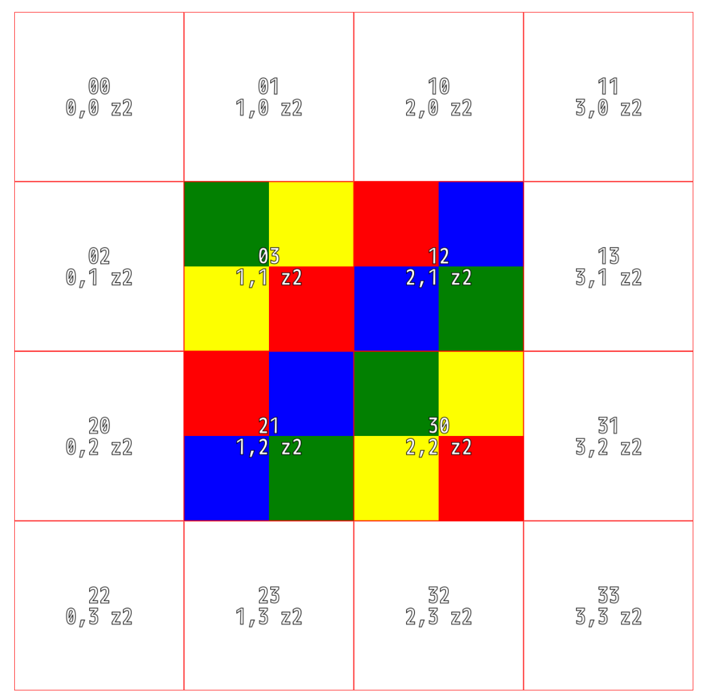
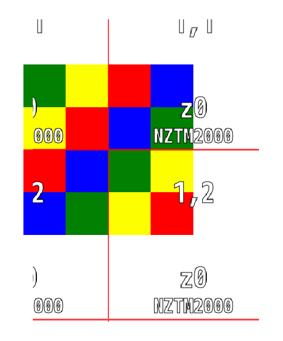

# @basemaps/test

Testing utlities and assets

## Approx equal

```typescript
import { approxEqual } from '@basemaps/test';

o('should be near', () => {
    approxEqual(1, 2, 'one two'); // `one two (1 vs 2) should be less than 0.001`
});
```

## TestTiffs

Two RGB Testing tiffs are provided for Google (epsg:3857) and NZTM2000 (epgs:2193) projections

```typescript
import { TestTiff } from '@basemaps/test';

// Create a new CogTiff for each projection
const google = TestTiff.Google;
const nztm2000 = TestTiff.Nztm2000;

// They need to be initialized
await Promise.all([google.init(), nztm2000.init()]);
```

### rgba8.google.tiff



### rgba8.nztm.tiff

Due to NZTM2000 being a weird tiling scheme and z0 having 2x4 with half the tiles being outside of the extent, this tiff is centered around tiles: 0.5, 1.5 -> 1.5, 2.5


