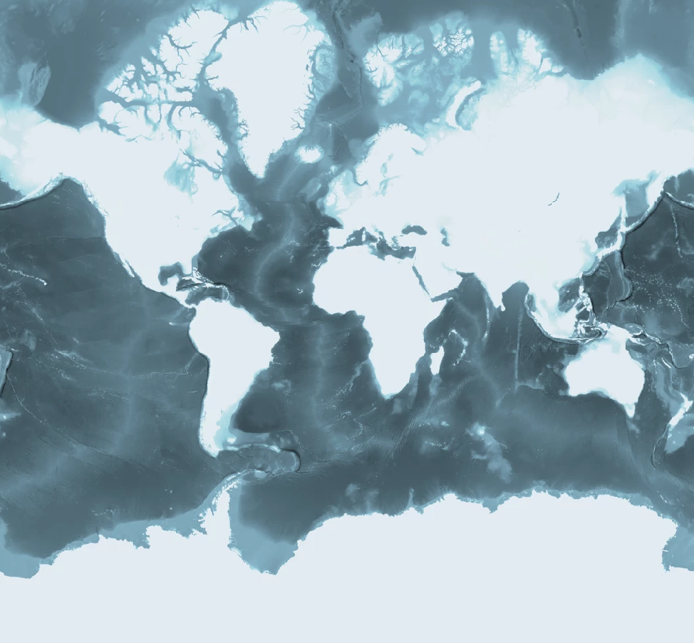
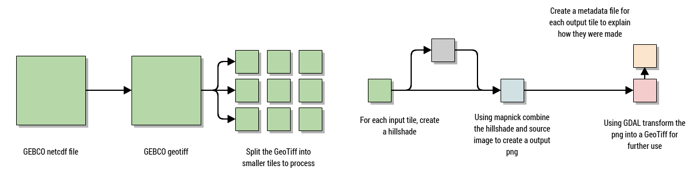

# Bathymetry creation


This process takes batheymetric data from [GEBCO](https://www.gebco.net/) and converts it into a colorized hillshaded geotiff.




## Usage

You will need:

- Gebco netcdf file [here](https://www.gebco.net/data_and_products/gridded_bathymetry_data/)
- Docker (or a new gdal 3+ with netcdf support)
- Node >= v12

```bash
# Install dependencies
yarn add @basemaps/bathymetry

# To prevent very long CI/Dev build times, mapnik will need to be manually installed 
yarn add mapnik

# Create a the data file
basemaps-bathymetry gebco_2020.nc -v --docker
```


## Process


