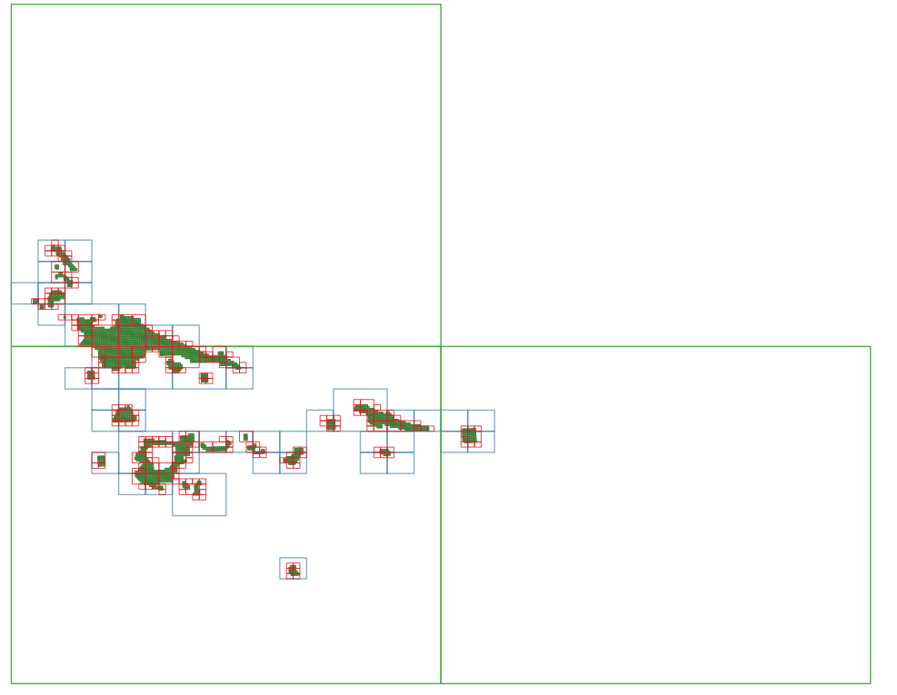

# @basemaps/cog

Create a collection of cloud optimized geotiff's from a collection of geotiff, that is optimized to be used in `@basemaps/tiler`

## Install

This script requires docker to be installed

To install cogify

```bash
npm i @basemaps/cog
```

## Usage

Create a list of COG's to create

```bash
cogify -V job --source ./source_folder/ --output ./source_folder/cogify/
```

Build a specific COG

```bash
cogify -V cog --job ./cogs/01DYREBEEFFXEPBAYBED2TMAFJ/job.json --name 1-2-3 --commit
```

Build all the COGs using aws BATCH

```bash
cogify -V batch --job ./cogs/01DYREBEEFFXEPBAYBED2TMAFJ/job.json --commit
```

## Advanced Job creation

Useful configuration options for `cogify job`

### Min Tile zoom `--min-zoom :number`

using the argument `--min-zoom` will configure the highest COG tile that can be created
for example, `--min-zoom 10` means tiles of zoom `0 - 10`  can be created but `11` cannot.

This is useful to control the size of COGS across varying imagery sets World level z0-5 vs region z12-15 vs specific area 20+

### Concurrency `--concurrency :number`

To load metadata quickly from S3 a lot of actions are run concurrently. using `--concurrent` controls the number of requests that can be outstanding at one time.

### Max COGs `--max-cogs :number`

Controls the number of output COGs to create for small imagery sets (<50GB) this number should be low < 5 for larger imagery sets this number can be much larger (100+ for TB+ imagery sets)

### GeoJson `--geojson`

Outputs two GeoJSON files to provide a representation of the source and target imagery, this can be used to help tune the generation parameters

## Building a COG collection

The best way to build a cog collection is to create multiple JOBS with `--geojson` enabled while adjusting `--max-cogs` and `--min-zoom` when a good covering is found the job can then be submitted to AWS for processing.


Using a large area of interest as shown in the imagery set below and is showing three different sets of parameters, The shaded green area is the original source imagery



### Green outline

**Arguments:** `--max-cogs 5 --min-zoom 15`
This has too much empty space inside the tile areas and is not a good example of a good collection of COGs to make.

### Red outline

**Arguments:** `--max-cogs 500 --min-zoom 25`

This creates too many tiles with many only including one or two source images.

### Blue outline

**Arguments:** `--max-cogs 70 --min-zoom 20`

This creates a decent covering without wasting too much space and not creating large area's of empty COG
