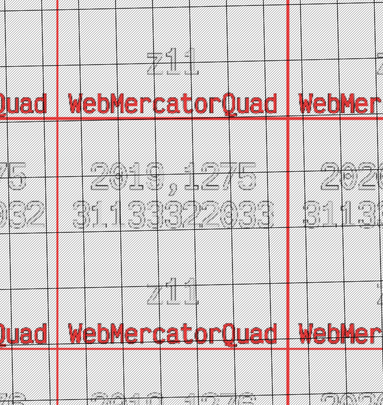

# @basemaps/cogify

CLI to retile imagery into a [Cloud Optimised Geotiffs (COG)](https://www.cogeo.org/) aligned to a [TileMatrix](https://www.ogc.org/standard/tms/)

## Why ? 

LINZ gets most of it's imagery delivered as tiles in [NZTM2000](https://www.linz.govt.nz/guidance/geodetic-system/coordinate-systems-used-new-zealand/projections/new-zealand-transverse-mercator-2000-nztm2000) the imagery is tiled as rectangles against a tile grid such as the [1:5k](https://data.linz.govt.nz/layer/104691-nz-15k-tile-index/) or [1:1k](https://data.linz.govt.nz/layer/104692-nz-11k-tile-index/).

These grids are not designed for use in XYZ tiles services in [WebMercator/EPSG:3857](https://epsg.io/3857), If the tiles were converted directly to WebMercator there would be significant overlap between multiple source imagery tiffs and a output WebMercator tile. This would cause large overheads for basemaps to render tiles as it would need to fetch data from all of the tiffs inside of the output tile.


Above is an example of a web mercator zoom 11 tile (Red outline) and the number `1:5k` tiles required to render (Shaded black) it

This package contains the logic to process input imagery into a output Tile Matrix to create optimised COGs for web mapping purposes.

The output COGS perfectly align to a output tile, greatly increasing XYZ tile service performance.

### Process

To convert imagery to optimized COG, a output tile cover is created, this covers the source imagery in tiles from the output tile matrix.

```
cogify cover --tile-matrix WebMercatorQuad s3://linz-imagery/.../porirua_2020_0.1m --target ./output
```

The metadata for the optimized COGS is written into the output folder where the COG creation step can use [GDAL](https://github.com/gdal/gdal) to create the output tiff.


```
cogify create ./output/WebMercatorQuad/porirua_2020_0.1m/01GY8W69EJEMAKKXNHYMRF7DCY/14-16150-10245.json
```

The output COG can be validated to ensure it matches the tile exactly.

```
cogify validate  --tile-matrix WebMercatorQuad ./output/WebMercatorQuad/porirua_2020_0.1m/01GY8W69EJEMAKKXNHYMRF7DCY/14-16150-10245.tiff
```

## Usage


Install `cogify` using `npm`
```
npm install -g @basemaps/cogify
```


```
$ cogify --help

- cover - Create a covering configuration from a collection from source imagery
- create - Create a COG from a covering configuration
```


### Covering

Create a tile covering for WebMeractorQuad from source imagery located in s3 and outputs the resulting configuration files into `./output/:projection/:imageryName/:id/collection.json`

```
cogify cover --tile-matrix WebMercatorQuad s3://linz-imagery/new-zealand/north-island_2023_0.5m/rgb/2193/ --target ./output
```

### Create

Create the first COG from the list
```
cogify create ./output/3857/north-island_2023_0.5m/:id/14-16150-10245.json
```

